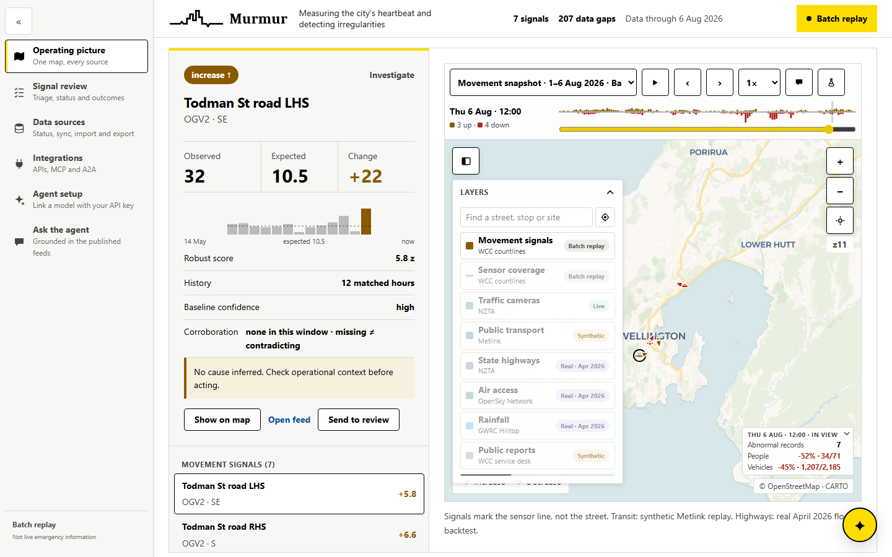
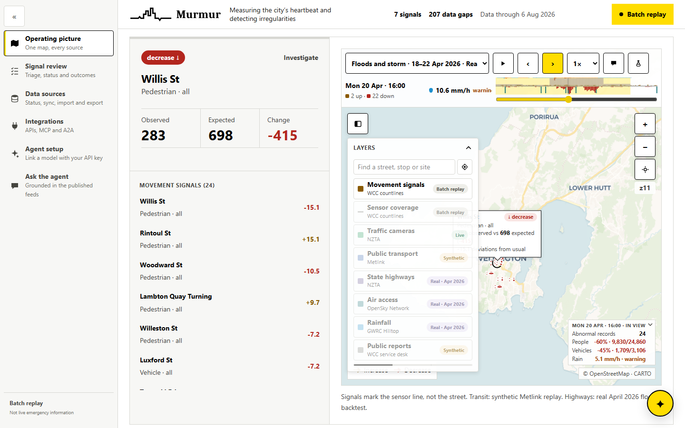
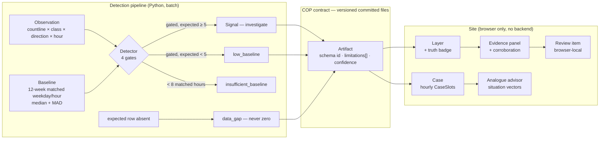
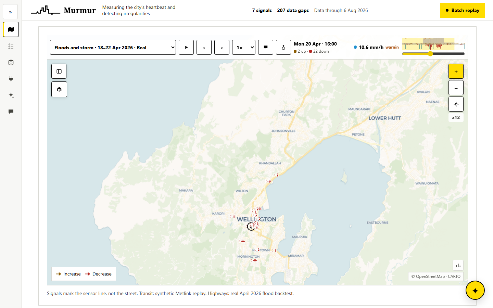
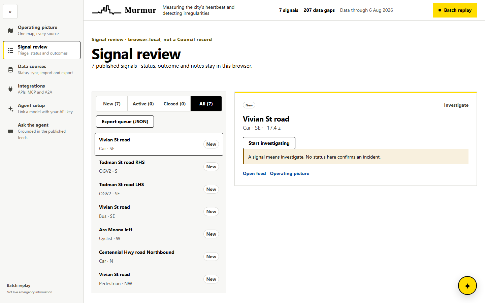
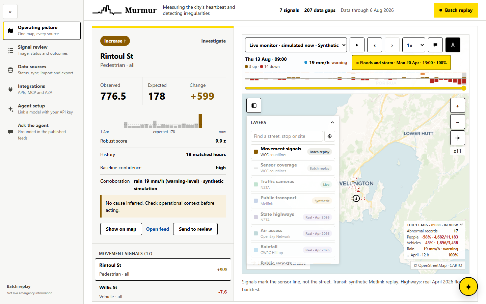
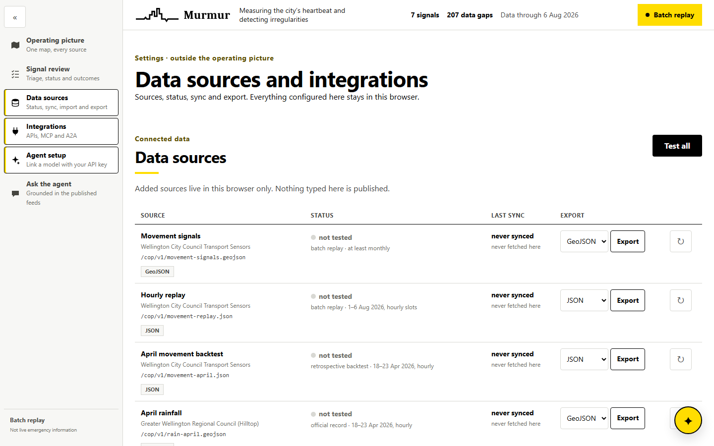

# Impact Lab Wellington — Team 7

**Wellington City Council Emergency Management × Claude Code Community NZ**
Saturday 8 August 2026 · Waimanga Room, Wellington City Council

**16:30 demo deck** — https://github.com/claudecommunity-nz/impact.lab.wlg.team-7.2026-08-08/blob/main/Team7_Problem05_movement_anomalies.pptx

**video link** — https://www.youtube.com/watch?v=BJZiOcQzmTU


---

## Problem 05 — Detect unusual changes in movement around the city

> How might we identify and map sudden changes in pedestrian or vehicle movement that could indicate disruption, unsafe conditions, evacuation or loss of access?

A prototype could compare current or recent movement with usual patterns and flag significant changes for investigation. It could also compare movement changes with weather warnings, road closures or public reports.

This could build on Pōneke Travel Insights, which already allows users to examine movement patterns, busy periods and changes over time. The existing material notes that the data has limitations, which would need to be visible in any emergency use.

**Desired outcome:** WCC receives another early indication of where an event may be affecting people, rather than relying only on individual reports.

*The common theme is improving the flow and use of information between communities and Council before and during an event.*

---

## What we're building

One working prototype, demoed in four minutes at 16:30.

Each team's module is meant to slot into a shared **common operating picture** —
a live map of emergency signals that the ten prototypes feed together. Aim for
something that can be pointed at a map, a feed or an API, rather than a
closed-off demo.

Two teams work each problem statement independently. That's deliberate: two
honest attempts at the same problem tell WCC more than one.

## Data

The public GIS datasets Wellington City Council Emergency Management shared are
catalogued, checked and made queryable here:

- **Catalogue + SDK** — https://github.com/claudecommunity-nz/wcc-emergency-gis-data
- **Browse the datasets** — https://claudecommunity-nz.github.io/wcc-emergency-gis-data/

74 datasets: flood, landslide, earthquake, tsunami, coastal inundation and
climate layers, plus emergency hubs, post-quake road reopening order, water
tanks, deprivation by area, and live river-level and rainfall telemetry.
`wcc_gis.py` is a single file with no dependencies — copy it and
`catalogue.json` into your project.

```python
import wcc_gis

wcc_gis.ids("tsunami")                                    # find datasets
wcc_gis.features("tsunami-evacuation-zones", at=(-41.2790, 174.7804))
wcc_gis.geojson("footpaths", bbox=wcc_gis.WELLINGTON)     # straight into MapLibre
wcc_gis.hilltop_data("Hutt River at Taita Gorge", "Flow")[-1]
```

Three traps worth knowing before you lose an hour to them:

- Everything is published in **NZTM2000, not lat/lng**. Request raw and your
  pins land off the coast of Africa. Always ask for `outSR=4326`.
- **A quarter of the layers are rasters** that advertise a query capability,
  then refuse to answer. Ask them for a PNG instead.
- **One query is silently capped** (`footpaths` has 8,130 features; a request
  returns 2,000). Page properly, or check `exceededTransferLimit`.

### Team 7 movement pipelines

Our own movement signals for Problem 05 live under [`data/`](data/) — one folder
per source, each with table definitions and load steps. Raw data is not committed
(it belongs to its publishers); only definitions, scripts and docs.

- **[`data/sensors/`](data/sensors/)** — WCC transport countlines: hourly pedestrian & vehicle counts by location, direction and mode (2023-11 → 2026-08, 34.7M rows in DuckDB).
- **[`data/planes/`](data/planes/)** — Wellington Airport arrivals/departures ingester: cancellations, diversions and delays as an air-access disruption signal.
- `data/google_traffic/`, `data/buses_trains/` — planned.

## Schedule

| Time | What |
|---|---|
| 08:00 | Arrival and mingle |
| 09:00 | Opening address & problem briefing |
| 09:30 | Build begins |
| 12:30 | Lunch + lightning talks |
| 16:00 | Submissions close |
| 16:30 | Demos + judging |
| 17:45 | Awards + next steps |

## Ground rules

- These are **hazard-planning layers, not live emergency information**.
  In an emergency, call 111.
- **The data is not ours.** Each dataset belongs to its publisher — WCC, Greater
  Wellington, GNS Science, NIWA, Wellington Water, MBIE, NZTA, MetService.
  Licence terms vary per dataset; check the dataset's page before publishing
  anything derived from it, and credit the publisher.
- Be considerate with request rates. These are council servers, and at least one
  host throttles under concurrent load.
- **Keep personal details out of this repo.** It is public. No participant
  names, contact details or application material.
- Treat public social content as a *signal to investigate*, never as verified
  fact — surfacing something unverified as confirmed is the failure mode these
  problem statements are most wary of.

## Licence

Code here is MIT unless stated otherwise. The data is not covered by it.

---

## Working prototype: Murmur

**Murmur** — measuring the city's heartbeat and detecting irregularities. It maps
unusual hourly pedestrian and vehicle counts at WCC Transport Sensor countlines,
and publishes the same evidence as WGS84 GeoJSON for the shared common operating
picture. The map is a view; **the feed is the product**.



### Why Murmur is different

- **We benchmarked the fancy models and picked the transparent one.** On a
  chronological train/validation/test split over 864,424 observations (no
  future leakage, no cherry-picked random split), the matched weekday/hour
  seasonal median beat every trained regressor on held-out July 2026 data —
  **MAE 7.37 vs 23.81 for XGBoost**, 32.86 for a linear SVR and 42.02 for
  ridge regression. The source has no verified incident labels, so a
  classifier could only learn our own labelling rule back; the model that won
  is one an EOC operator can check by hand. Full reasoning in
  [`docs/model-card.md`](docs/model-card.md), machine-readable result in
  [`artifacts/model-benchmark.json`](artifacts/model-benchmark.json), rerun it
  with [`scripts/benchmark_models.py`](scripts/benchmark_models.py) (needs the
  gitignored WCC Parquet and `pip install -e ".[benchmark]"`).
- **Absence is a signal.** Most dashboards silently zero-fill missing data —
  which reads as "the city went quiet" exactly when a sensor (or the city)
  broke. Murmur models expected-but-missing groups as first-class
  **data gaps**, never zeros, and puts the count on the front page.
- **The truth boundary is in the interface, not a footnote.** Every feature
  ships with sample size, confidence, publisher cadence, data age and a
  `limitations` array; the batch is labelled *batch replay*, the synthetic
  layer says *synthetic* at every appearance, and signals say *investigate* —
  never *incident*.
- **Corroboration over aggregation.** Six independent sources share one map
  and one projection, each with its own icon: a countline drop can be checked
  against a live NZTA camera frame two clicks away, instead of being averaged
  into a single opaque score.
- **Privacy-first AI.** The built-in agent answers only from the published
  artifacts — it cannot invent a signal. Linking a frontier model
  (Anthropic, OpenAI, Gemini, DeepSeek) is bring-your-own-key: the key lives
  in the visitor's browser and goes only to the provider. A test suite scans
  the repo for key-shaped strings on every build.
- **No backend to fall over.** The site is static files plus the visitor's
  browser — twelve committed GeoJSON/JSON contracts any COP, GIS client or
  teammate's prototype can consume directly.

### What we found

- **The April backtest lands on the streets that actually flooded.** Run
  street by street inside WCC's own boundary (same detector maths, baselines
  outside the event window), 18–23 April 2026 yields **776 flagged
  street-hours** — 288 and 327 on the two flood days against 30–53 on the
  days around them, 601 of them decreases. The city visibly stopped moving,
  street by street.
- **The flagged streets read like the incident log**: Rintoul St (44 flagged
  hours), Aro St (26), Karori Rd (18), Riddiford St (11), The Parade (9, all
  on the flood days) — Newtown, Berhampore, Aro Valley, Karori, Island Bay,
  the southern suburbs where the 20 April flooding and slips concentrated.
  The coverage is there to see it: 53 of the 414 countlines sit south of
  −41.31, sixteen on The Parade alone.
- From the real 6 August 2026 12:00 replay (WCC countlines, 34.7M source
  rows): **7 signals worth investigating** out of 2,728 observed
  countline × class × direction groups — a shortlist, not a wall of amber.
  The loudest is a large-baseline decrease, **Vivian St road (Car SE) — 640
  observed vs 1,259.5 expected (−17.4 z)**, with the same street's bus and
  pedestrian counts down in the same hour.
- **The low-baseline gate holds the dead sensors out of the queue.** A
  countline that has never reported a class suddenly reporting one is a
  commissioning or classification change until proven otherwise, so a gated
  deviation with an expected count under 5 is published as `low_baseline` in
  health — 2 in the snapshot, 107 across the replay — never as a signal.
- **207 data gaps** and 430 groups without enough baseline — a fifth of the
  picture is "we don't know", and saying so is the feature.
- Across the **hourly replay** (1–6 Aug, 144 published hours): 686 gated
  candidates in total, between 0 and 30 per hour — scrub the timebar and the
  quiet hours are visibly quiet, which is what precision gates are for.
- Corroboration from outside the city's own sensors, same April event: the
  **real** NZTA TMS backtest flagged the floods blind — the SH2/Wairarapa
  corridor collapsed to 0.08–0.57× its own baseline (worst: South of Waingawa
  Bridge at 0.35×, −39.4 z) while SH1 stayed normal, matching the actual
  closures and the regional state of emergency declared 20 April — and the
  **real** OpenSky backtest shows WLG flight movements at 0.16–0.26× their
  hourly baselines the same flood afternoons (20 April 14:00: 4 movements vs
  15.5 expected), an independent witness no road sensor can see.
- From the labelled-synthetic Metlink replay: 75,087 injected anomalies
  condense to **350 stop-level hotspots** (Kilbirnie Stop A worst at 270
  anomalies, 65 high-severity, delay-outlier dominated) — evidence the same
  hotspot pattern works for public transport when real GTFS-RT is captured.



### Key takeaways

- **When there are no ground-truth labels, train nothing.** A robust seasonal
  baseline is more accurate here, and every flag it raises can be explained in
  one sentence: observed, expected, and how unusual.
- **A missing row and a zero are different facts.** Zero-filling would have
  buried 207 gaps inside fake calm.
- **Reliability metadata must travel with the data**, or it is stripped at the
  first copy-paste. That is why it lives in the GeoJSON, not the UI.
- **Composable feeds beat closed dashboards** — ten prototypes can only form
  one operating picture if each publishes something the others can point at.
- **Honest labels are free.** "Batch replay" and "synthetic" cost one word
  each and remove the worst failure mode: unverified data presented as fact.

### How we know it works

The benchmark above is held-out, chronological and committed, and the script
that produced it is too: [`scripts/benchmark_models.py`](scripts/benchmark_models.py).
Nineteen Python tests and eighteen site checks run on every build — the
server-rendered contract, internal consistency of the artifacts (signal count
= candidate count, WGS84 bounds, camera frame flags vs coverage bounds,
synthetic labelling, and a leakage check on every replay slot's matched
history), and the secret scan. Every interactive feature was verified in a
real browser before merging. Every artifact is reproducible with the build
scripts below; the August movement artifacts and the benchmark need the
gitignored WCC Parquet (the committed August files carry the low-baseline
migration applied exactly by
[`scripts/reclassify_low_baseline.py`](scripts/reclassify_low_baseline.py)).

### Detection

- Matched weekday/hour **median + MAD** over the prior 12 weeks, per
  countline × transport class × direction.
- Precision gates: robust score ≥ 4.5, absolute change ≥ 10, relative change
  ≥ 35% and expected count ≥ 5 — a gated deviation on a near-zero baseline is
  published as `low_baseline` in health, never queued as a signal.
- Truth boundary: signals mean **investigate**; they do not diagnose disruption,
  evacuation or loss of access.
- Cadence: the WCC source is updated at least monthly, so the current build is a
  labelled **batch replay**, not a live feed. A missing row is a data gap, never
  a zero.

The included 6 August 2026 12:00 replay produces **7 signals** and exposes
**207 expected-but-missing groups** as data gaps rather than zero counts. The
full **hourly replay** keeps every published hour from 1–6 August: a timebar
above the map plays or scrubs through all 144 slots, its histogram showing
each hour's gated deviations (increases up, decreases down — counts, never raw
sums), and every signal carries its 12 prior matched weekday/hour counts as a
sparkline next to the expected median.

### Architecture ontology

The whole system is a small set of named concepts, and every file in the repo
is one of them or a mapping between two of them:



| Concept | Meaning | Lives in |
|---|---|---|
| **Observation** | One hourly count for countline × transport class × direction — the only input fact | `src/movement_anomaly/ingest.py` |
| **Baseline** | That group's 12-week matched weekday/hour median + MAD, minimum 8 samples | `detector.py` |
| **Signal** | A deviation passing all four gates; always *investigate*, never a diagnosed incident | `movement-signal/v1` |
| **Status** | `normal` · `candidate` · `low_baseline` · `insufficient_baseline` · `data_gap` — a missing row is a gap, never zero | every artifact |
| **Artifact** | A versioned committed file with schema id, `limitations[]` and confidence; the whole interface between pipeline and site | `site/public/cop/v1/` |
| **Layer** | One source drawn on the one canvas, carrying its truth badge (Live / Batch replay / Synthetic / Real · Apr 2026) | `map-draw.ts` |
| **Case** | A saved investigation window (Aug snapshot, April floods, Live monitor) as hourly `CaseSlot`s; one code path drives timebar, histogram and every time-bearing layer | `MovementCanvas.tsx` |
| **Corroboration** | An independent source agreeing in the same window (roads day, air tick, rain mm/h, reports rule); *missing ≠ contradicting* | evidence panel |
| **Review item** | Browser-local triage state keyed at place level; `movement-review/v1` on export, never a Council record | `review-store.ts` |
| **Analogue** | Cosine match of the current six-number situation vector against saved case hours; an advisory to investigate, never a forecast | `analogue.ts` |

### One map, every source

A hand-rolled slippy map on one canvas — CARTO Voyager raster tiles
(OpenStreetMap data), whole-level zoom 9–18, drag to pan, scroll or +/− to zoom,
**Fit** to frame the active layers, no map library. Every source is a
**toggleable layer**, each drawn with its own mini icon, and an
**investigation-case dropdown** on the timebar frames the published windows in
one click: the 1–6 Aug movement snapshot, and the real 18–22 Apr floods case,
which loads every April layer at once:

- **Movement signals** — the detection output above, with a people/vehicles
  filter. **Person icons** mark pedestrian, cyclist and e-scooter signals;
  **car icons** mark the vehicle classes; amber = increase, red = decrease.
- **Sensor coverage** — all 414 measured WCC countlines.
- **Traffic cameras** — 38 Wellington-region NZTA cameras as tiny **camera
  icons**. Hovering one pops up its **live frame**, re-requested every 15 s
  while open; frames load straight from NZTA in the browser and are never
  stored or re-published here. Cameras corroborate a countline signal, they do
  not measure one. Frame capture for change detection is
  [`streamlit/traffic_camera/`](streamlit/traffic_camera/).
- **Public transport** — Metlink anomaly hotspots as tiny **bus icons** (blue,
  red where high-severity anomalies concentrate), built from the
  [`data/buses_trains/anomaly/`](data/buses_trains/anomaly/) extracts.
  **Synthetic**: the real Metlink timetable replayed with simulated running and
  injected, labelled anomalies — the layer says so wherever it appears.
- **State highways** — NZTA TMS sites flagged in the **real 20–21 April 2026
  Wellington floods** as purple **diamond icons** (darker where severity is
  high), built from the [`NZTA/anomaly/`](NZTA/anomaly/) extracts. Daily counts
  with a two-day lag: a validated backtest, not a live detector. Each site's
  evidence now includes its full April daily strip — observed against its own
  baseline, flagged days highlighted.
- **Air access** — Wellington Airport as a teal **plane icon**: real OpenSky
  flight movements, April 2026, scored per hour against weekday-matched
  baselines. Its flagged drops land on the same flood afternoons the highway
  layer flags — independent corroboration from the air. Data © OpenSky
  Network.

Hovering a signal or a PT hotspot shows its numbers in place; clicking anything
fills the **investigate panel** — observed vs expected counts, robust score,
sample size, confidence, worst example, and the reliability caveats that ship
with every feature.

### One screen you can put away

The interface folds down to the map. The snapshot facts (signals, data gaps,
data age) live in the title bar, so the map and its timebar take the viewport
from the first paint:

- **The rail** on the left of every route collapses to an icon strip (a
  scrollable row on small screens).
- **The investigate panel** sits left of the map and slides away from the «
  toggle in the map's top-left corner, the canvas growing into the space. It is
  put away, not merely hidden: its controls leave the tab order.



### Signal review

`/review` (in the rail) is the triage queue over the published signals. Every
signal starts **New**; an operator starts an investigation, closes it as
**true positive, benign positive, false positive or undetermined**, and keeps
notes. The four queues — New / Active / Closed / All — always track the current
artifact, because only touched items are stored. On the map, signal evidence
gains a **Send to review** operation, the signal list tags items already in
review, and a **Corroboration** row states what the other loaded sources say
for the case window — and when none covers it, "missing ≠ contradicting":
absence adds uncertainty, it never clears a signal. Status and notes live in
that browser's localStorage only — working notes for a shift, never a Council
record, and no status confirms an incident. **Export queue (JSON)** hands the
whole queue over as a `movement-review/v1` contract with those truth
boundaries embedded, so a shift handover or the shared COP can consume it
without ever mistaking it for confirmed fact.



### Live monitor and the analogue advisor

The case picker's third mode is a **Live monitor**: there is no live WCC
movement-sensor API today, so it runs a loudly-labelled **simulation** — 48
hourly slots ending at a reference "now", quiet and then a storm ramp cloned
from the real April 2026 trajectory (same streets, 0.85 scale). The flask
icon in the timebar enters and leaves simulation mode. As the simulated storm
builds, the **analogue advisor** compares the trailing three hours against
every hour of the saved April investigation using a six-number situation
vector (signals down/up, vehicle and people drop, rain, warning state —
fixed, stated scales; cosine similarity; no fitted weights). When the match
clears 70% a yellow `≈` chip appears: *"Floods and storm · Sun 20 Apr ·
14:00 · 87%"* — click it and the saved investigation opens at that hour. An
analogue is an advisory to investigate, never a forecast: the same doctrine
as every other surface, now pointed at history.



### The Murmur agent

A floating ✦ button on every page opens the chat; ⤢ expands it to full screen
(Escape backs out one step). By default it answers **locally from the committed
artifacts only** — it assembles replies out of those numbers, so it cannot
invent a signal that is not in the feed, and says "I do not hold that" rather
than guessing. It carries the same truth boundary as the map: signals mean
investigate, PT running is synthetic, and in an emergency it points at 111.

**Agent setup** (`/settings#agent`, in the rail) links the chat to a hosted
model instead: **Anthropic Claude, OpenAI, Google Gemini or DeepSeek** from a
model dropdown (with a custom-model escape hatch), or any custom endpoint.
Questions then go straight from the visitor's browser to that provider with
the artifacts as grounding context. **Test the link** fires one tiny timed
request and reports the result inline; any provider failure names its cause
and falls back to the local answer.

### Settings: sources and integrations

**Data sources** (`/settings`, deliberately not on the dashboard) lists the
twelve committed feeds plus anything you add, with **measured** status per source —
reachable, reachable-with-odd-payload, or failed — last successful sync, latency
and record count, a retry per row and **Test all**. Sources can be added by URL
or imported from a file, and exported as **GeoJSON, JSON, CSV or NDJSON**.
**Integrations** registers REST, MCP, A2A and webhook endpoints, tests them, and
generates the MCP client config and the A2A agent card for your own endpoint.



### The feeds

Everything the site shows is served as twelve committed files, **hosted at**
`https://claudecommunity-nz.github.io/impact.lab.wlg.team-7.2026-08-08` —
point any COP, GIS client or teammate's prototype at them:

| Feed | Path |
|---|---|
| Movement signals | `/cop/v1/movement-signals.geojson` |
| Hourly replay (1–6 Aug 2026, 144 slots) | `/cop/v1/movement-replay.json` |
| April movement backtest (18–23 Apr 2026, hourly) | `/cop/v1/movement-april.json` |
| Sensor coverage | `/cop/v1/countline-coverage.geojson` |
| Traffic cameras | `/cop/v1/traffic-cameras.geojson` |
| PT anomalies (synthetic) | `/cop/v1/transit-anomalies.geojson` |
| State highways (real April 2026 floods) | `/cop/v1/road-anomalies.geojson` |
| Air access (real April 2026, OpenSky) | `/cop/v1/flight-anomalies.geojson` |
| Rainfall (real April 2026, GWRC Hilltop) | `/cop/v1/rain-april.geojson` |
| Public reports (synthetic ticket flow) | `/cop/v1/reports-april.geojson` |
| Live-monitor simulation (synthetic, 48 h) | `/cop/v1/live-sim.json` |
| Coverage and health | `/cop/v1/movement-health.json` |

Live, no clone needed:

```
curl https://claudecommunity-nz.github.io/impact.lab.wlg.team-7.2026-08-08/cop/v1/movement-health.json
```

The rainfall and public-report layers close the last two limbs of problem 05
("compare movement changes with weather warnings, road closures or public
reports"): rain is the real GWRC gauge record classed by fixed WMO intensity
definitions, and the reports layer demonstrates the service-desk ticket flow —
clustering, source grades, count-raises-level escalation and an explicit
corroboration rule against the movement detector — with synthetic,
privacy-clean records anchored on genuinely flagged streets.

### Keys and secrets stay out of this repo

API keys and tokens live in the visitor's browser `localStorage` only and are
sent only to the chosen provider's host — never to this repo or the site.
Config export strips keys and tokens on the way out, `.gitignore` refuses
env/key files, and the test suite **scans the source for key-shaped strings**
(Anthropic, OpenAI, Google, GitHub, webhook secrets, private-key blocks) and
fails the build naming the offending file.

### Run it

```powershell
python -m venv .venv
.\.venv\Scripts\pip install -e ".[test]"
.\.venv\Scripts\python -m pytest -q

cd site
npm install
npm test
npm run dev
```

Rebuild the COP artifacts (snapshot + hourly replay) from the official WCC
Transport Sensors Parquet shards and countline metadata:

```powershell
.\.venv\Scripts\python scripts\build_demo.py `
  --data-dir data\transport_sensors `
  --metadata data\countline_meta_info.csv `
  --target-at 2026-08-06T12:00:00+12:00 `
  --replay-start-at 2026-08-01T00:00:00+12:00 `
  --replay-end-at 2026-08-06T23:00:00+12:00 `
  --output-dir site\public\cop\v1
```

Rebuild the camera layer from the live NZTA catalogue (network, no Parquet):

```powershell
.\.venv\Scripts\pip install -e ".[cameras]"
.\.venv\Scripts\python scripts\build_camera_layer.py
```

Rebuild the Metlink PT-anomaly layer from the committed extracts (stdlib only):

```powershell
python scripts\build_transit_layer.py
```

Rebuild the NZTA state-highway layer from the committed extracts (stdlib only):

```powershell
python scripts\build_road_layer.py
```

Rebuild the WLG air-access layer from the OpenSky extracts (stdlib only):

```powershell
python scripts\build_flights_layer.py
```

### Docs

[`docs/model-card.md`](docs/model-card.md) has the model comparison
([`artifacts/model-benchmark.json`](artifacts/model-benchmark.json) is its
machine-readable result), [`docs/demo-script.md`](docs/demo-script.md) is the
four-minute walkthrough, and the slides shown at 16:30 are
[here](https://docs.google.com/presentation/d/1tNyOVbC6gqecDB2m7Es2TQ7Am-KTfwbQ/edit?slide=id.p1#slide=id.p1).

